# covid19search
* Notebooks generating visualizations of Covid-19 keyword appearances
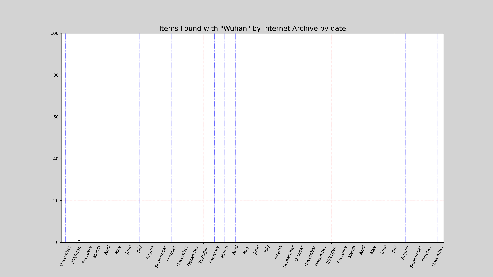 

### Richard Eldon Barber | [`kd6kxr@gmail.com`](mailto:kd6kxr@gmail.com)
#### 2 October 2021 | `/DTG//021930USEP21  //RB21A06001/`

#### Licensing:

* ##### [GNU Affero V3 2017](https://raw.githubusercontent.com/Benitoite/covid19race/main/LICENSE)

#### Sources:

* ##### The Internet Archive API (https://archive.org/advancedsearch.php)
* ##### Google Custom Search Ad-free Element API (https://developers.google.com/custom-search/docs/paid_element)

## Background

#### No Evidence: https://www.voanews.com/a/covid-19-pandemic_who-finds-no-evidence-covid-19-outbreaks-wuhan-december-2019/6201813.html
* https://www.who.int/news/item/30-03-2021-who-calls-for-further-studies-data-on-origin-of-sars-cov-2-virus-reiterates-that-all-hypotheses-remain-open

#### Satellite Evidence: https://www.cnbc.com/2020/06/09/coronavirus-may-have-been-spreading-in-china-in-august-harvard-study.html
* https://dash.harvard.edu/handle/1/42669767

#### Procurement Evidence: https://www.bloomberg.com/news/articles/2021-10-04/china-pcr-purchases-spiked-in-months-before-first-known-covid-cases-firm-says
* https://internet2-0.com/whitepaper/procuring-for-a-pandemic/

|   Contents:   |
| -----  |
|  [Internet Archive data](#internet-archive-archiveorg-data)  |
|  [Google News data](#google-custom-search-newsgooglecom-data)  |

## Analysis
### Internet Archive (archive.org) Data:

|  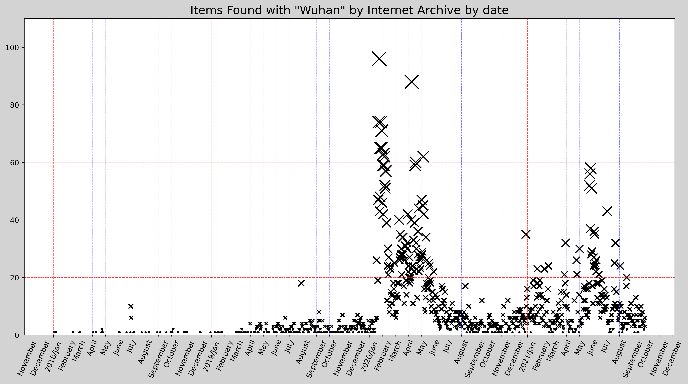   |
|:------|
|   Figure 1.  Internet Archive results for term "Wuhan".  [Benitoite/covid19search/blob/main/wuhansearch1.ipynb](https://nbviewer.jupyter.org/github/Benitoite/covid19search/blob/main/wuhansearch1.ipynb)   |

 

|  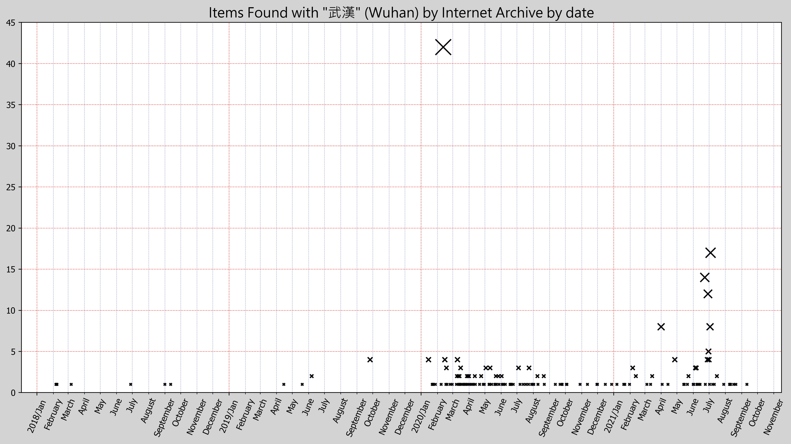   |
|:------|
|  Figure 2.  Internet Archive results for term "武漢" (Wuhan).  [Benitoite/covid19search/blob/main/wuhansearch1-chinese.ipynb](https://nbviewer.jupyter.org/github/Benitoite/covid19search/blob/main/wuhansearch1-chinese.ipynb)   |

 

|  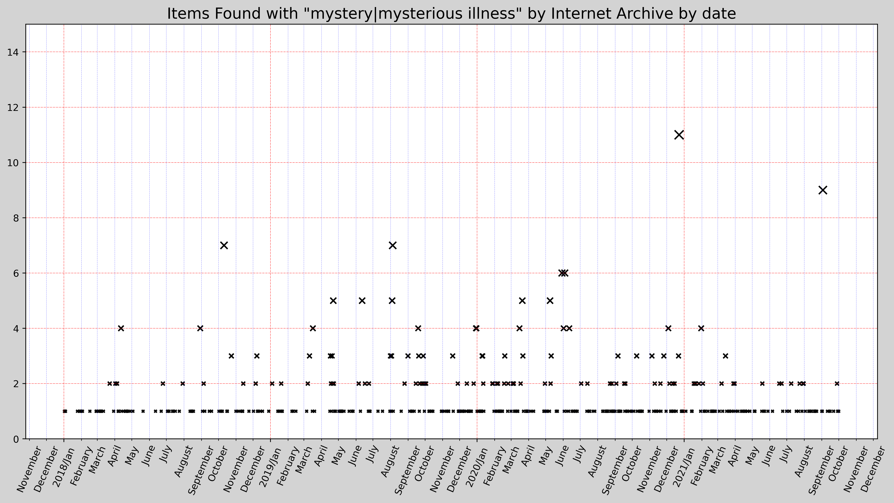   |
|:------|
|  Figure 3. Interet Archive results for term "Mystery\|Mysterious Illness".  [Benitoite/covid19search/blob/main/wuhansearch1-covid19-mysteriousillness.ipynb](https://nbviewer.jupyter.org/github/Benitoite/covid19search/blob/main/wuhansearch1-covid19-mysteriousillness.ipynb)   |

 

|  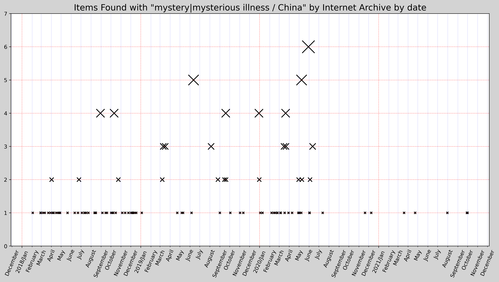   |
|:------|
|  Figure 4. Internet Archive results for term "Mystery\|Mysterious Illness, China".  [Benitoite/covid19search/blob/main/wuhansearch1-covid19-mysteriousillnesschina.ipynb](https://nbviewer.jupyter.org/github/Benitoite/covid19search/blob/main/wuhansearch1-covid19-mysteriousillnesschina.ipynb)   |

 

|  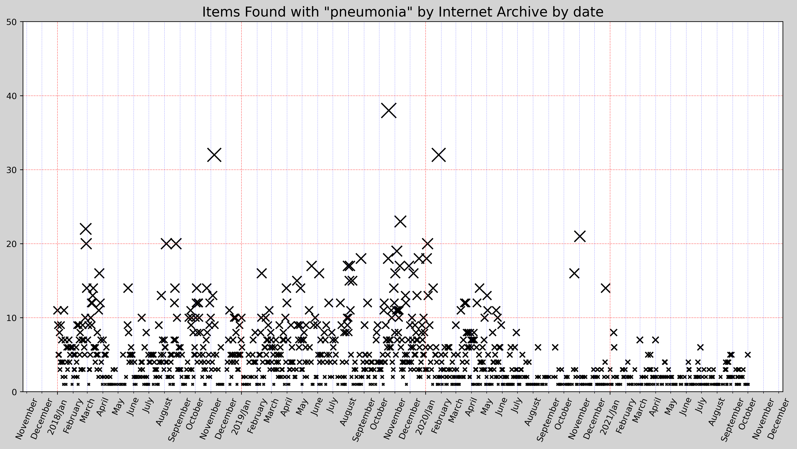   |
|:------|
|  Figure. 5. Internet Archive results for term "Pneumonia".  [Benitoite/covid19search/blob/main/wuhansearch1-pneumonia.ipynb](https://nbviewer.jupyter.org/github/Benitoite/covid19search/blob/main/wuhansearch1-pneumonia.ipynb)   |

 

|  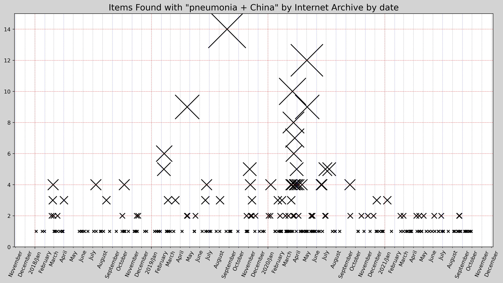   |
|:------|
|  Figure 6. Internet Archive results for term "Pneumonia+China".  [Benitoite/covid19search/blob/main/wuhansearch1-covid19-pneumoniachina.ipynb](https://nbviewer.jupyter.org/github/Benitoite/covid19search/blob/main/wuhansearch1-covid19-pneumoniachina.ipynb)   |

 

|  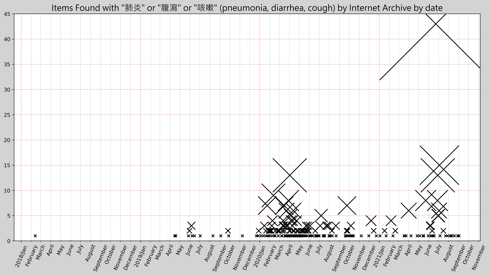   |
|:------|
|  Figure 7. Internet Archive results for term "肺炎 \| 腹瀉 \| 咳嗽" (Pneumonia, Diarrhea, Cough).  [Benitoite/covid19search/blob/main/wuhansearch1-covid19-pneumoniachinese.ipynb](https://nbviewer.jupyter.org/github/Benitoite/covid19search/blob/main/wuhansearch1-covid19-pneumoniachinese.ipynb)   |

 

|  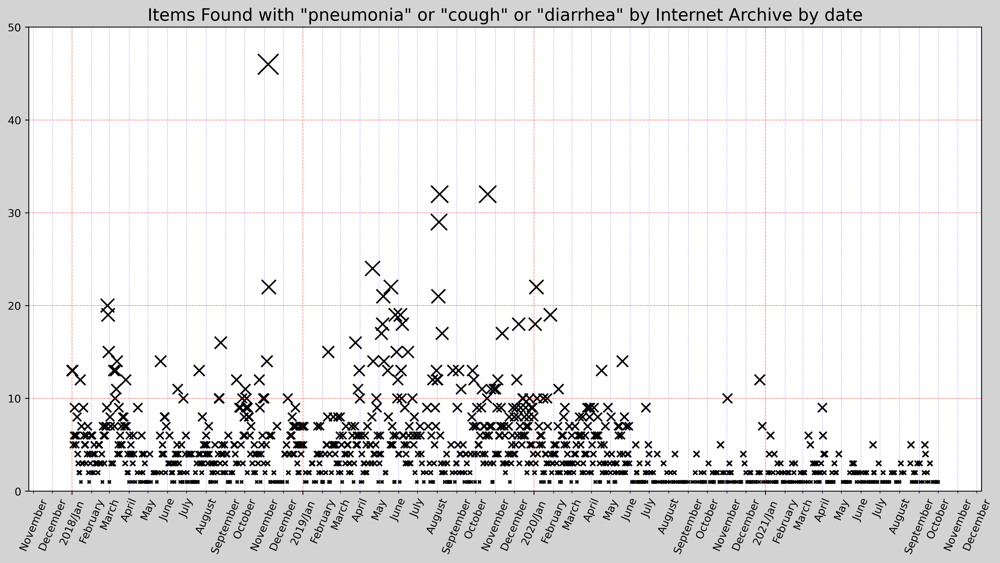   |
|:------|
|  Figure 8. Internet Archive results for term "Pneumonia \| Diarrhea \| Cough"  [Benitoite/covid19search/blob/main/wuhansearch1-pneumoniaetc.ipynb](https://nbviewer.jupyter.org/github/Benitoite/covid19search/blob/main/wuhansearch1-pneumoniaetc.ipynb)   |

 

|  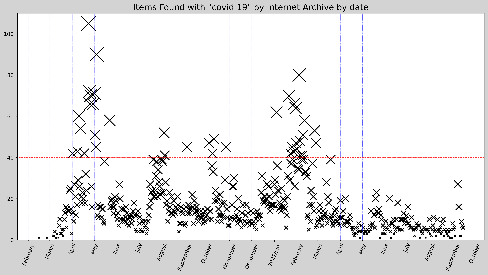   |
|:------|
|  Figure 9. Internet Archive results for term "Covid-19".  [Benitoite/covid19search/blob/main/wuhansearch1-covid19.ipynb](https://nbviewer.jupyter.org/github/Benitoite/covid19search/blob/main/wuhansearch1-covid19.ipynb)   |

 

### Google Custom Search (news.google.com) Data:

|  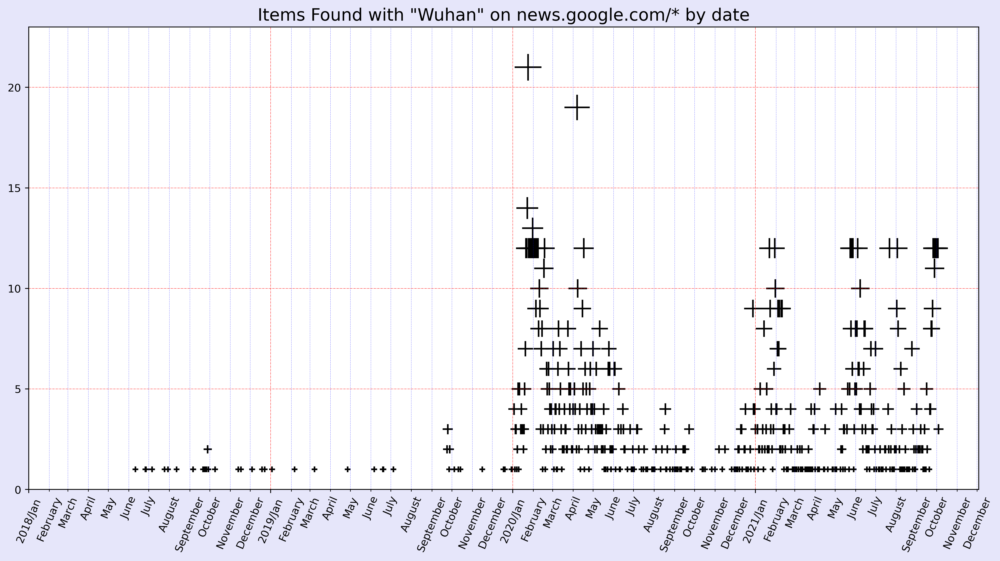   |
|:------|
|   Figure 10.  Google Custom Search results for term "Wuhan".  [Benitoite/covid19search/blob/main/wuhansearch1-gcse.ipynb](https://nbviewer.jupyter.org/github/Benitoite/covid19search/blob/main/wuhansearch1-gcse.ipynb)   |

 

|  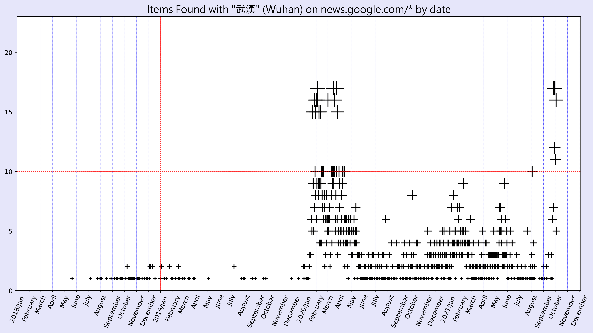   |
|:------|
|  Figure 11.  Google Custom Search results for term "武漢" (Wuhan).  [Benitoite/covid19search/blob/main/wuhansearch1-gcse-wuhanchinese.ipynb](https://nbviewer.jupyter.org/github/Benitoite/covid19search/blob/main/wuhansearch1-gcse-wuhanchinese.ipynb)   |
 

|  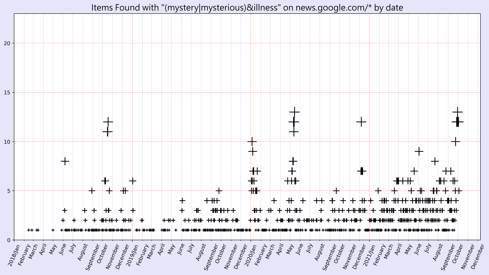   |
|:------|
|  Figure 12. Google Custom Search results for term "Mystery\|Mysterious Illness".  [Benitoite/covid19search/blob/main/wuhansearch1-gcse-mystery.ipynb](https://nbviewer.jupyter.org/github/Benitoite/covid19search/blob/main/wuhansearch1-gcse-mystery.ipynb)   |

 

|  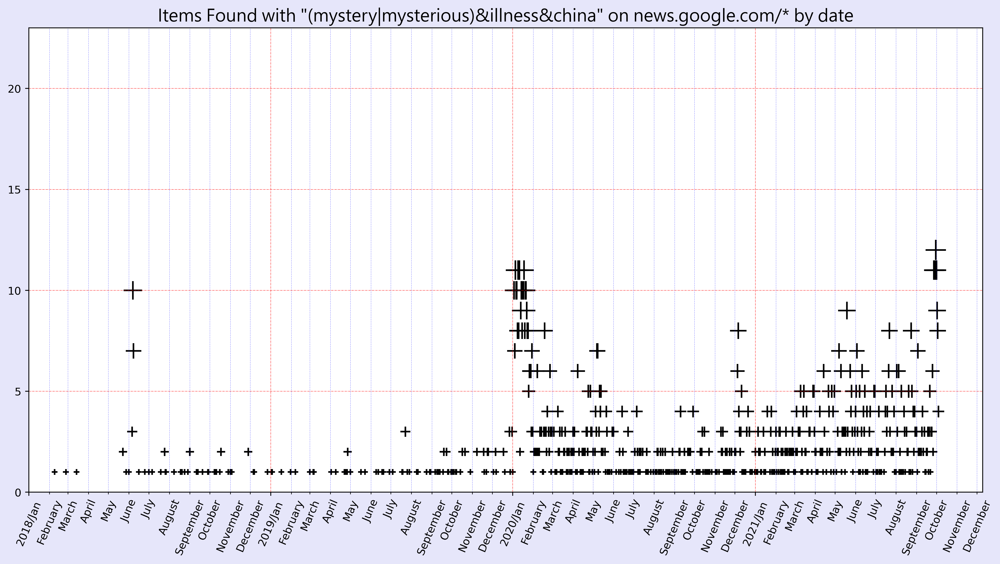   |
|:------|
|  Figure 13. Google Custom Search results for term "Mystery\|Mysterious Illness, China".   [Benitoite/covid19search/blob/main/wuhansearch1-gcse-mysterychina.ipynb](https://nbviewer.jupyter.org/github/Benitoite/covid19search/blob/main/wuhansearch1-gcse-mysterychina.ipynb)   |

 

|  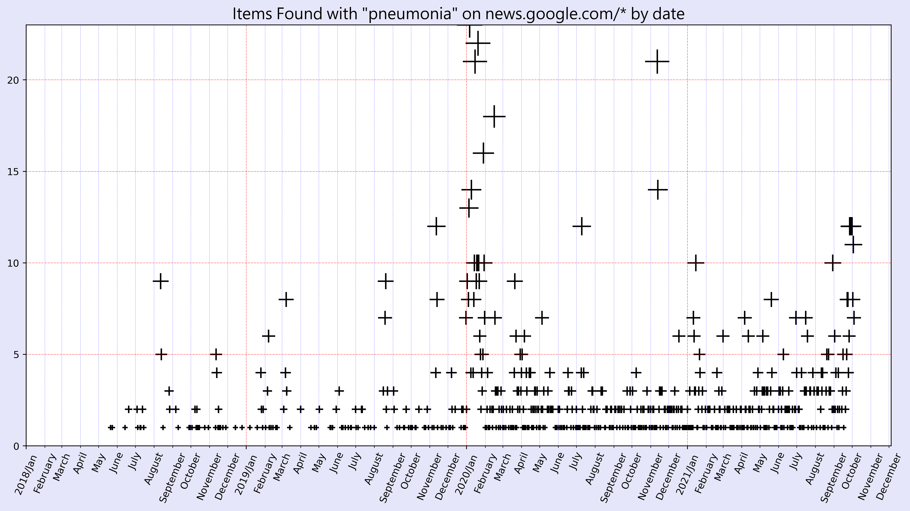   |
|:------|
|  Figure. 14. Google Custom Search results for term "Pneumonia".  [enitoite/covid19search/blob/main/wuhansearch1-gcse-pneumonia.ipynb](https://nbviewer.jupyter.org/github/Benitoite/covid19search/blob/main/wuhansearch1-gcse-pneumonia.ipynb)   |

 

|  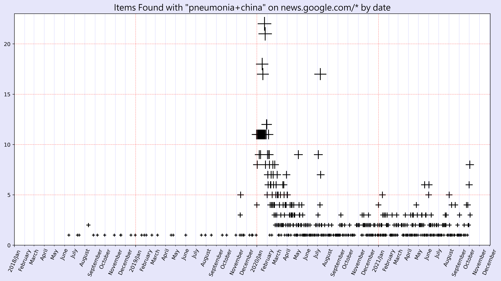   |
|:------|
|  Figure 15. Google Custom Search results for term "Pneumonia+China".  [Benitoite/covid19search/blob/main/wuhansearch1-gcse-pneumoniachina.ipynb](https://nbviewer.jupyter.org/github/Benitoite/covid19search/blob/main/wuhansearch1-gcse-pneumoniachina.ipynb)   |

 

|  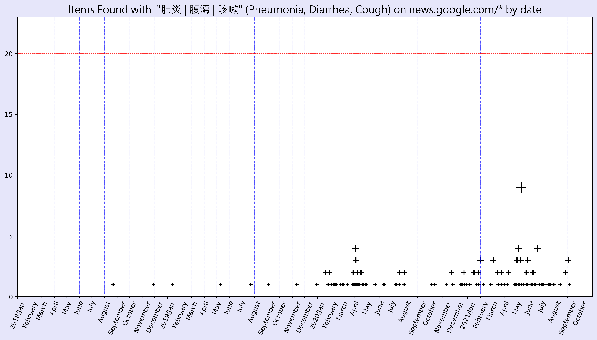   |
|:------|
|  Figure 16. Internet Archive results for term "肺炎 \| 腹瀉 \| 咳嗽" (Pneumonia, Diarrhea, Cough).  [Benitoite/covid19search/blob/main/wuhansearch1-gcse-pneumonia-chinese.ipynb](https://nbviewer.jupyter.org/github/Benitoite/covid19search/blob/main/wuhansearch1-gcse-pneumonia-chinese.ipynb)   |

 

|  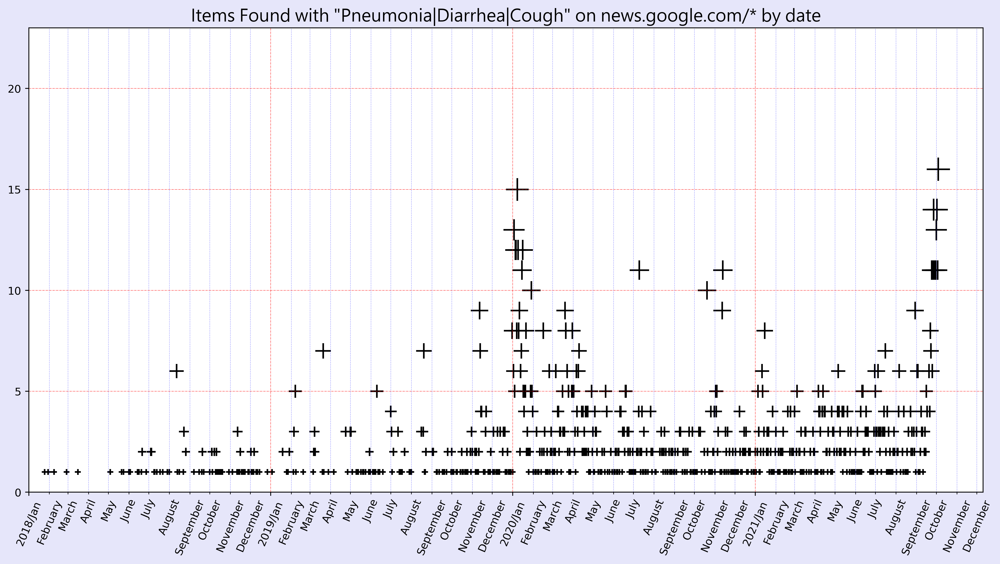   |
|:------|
|  Figure 17. Google Custom Search results for term "Pneumonia \| Diarrhea \| Cough"  [Benitoite/covid19search/blob/main/wuhansearch1-gcse-pneumoniaetc.ipynb](https://nbviewer.jupyter.org/github/Benitoite/covid19search/blob/main/wuhansearch1-gcse-pneumoniaetc.ipynb)   |

 

|  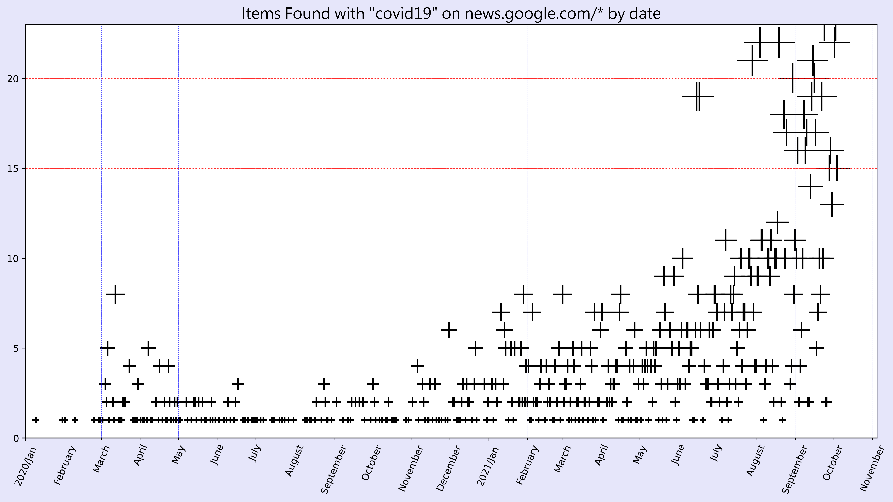   |
|:------|
|  Figure 18. Google Custom Search results for term "Covid-19". [Benitoite/covid19search/blob/main/wuhansearch1-gcse-covid19.ipynb](https://nbviewer.jupyter.org/github/Benitoite/covid19search/blob/main/wuhansearch1-gcse-covid19.ipynb)   |

 

## Results
* "Pneumonia China" 2019 Anomaly  
* "Wuhan" 2019 Anomalous Inlier
* "肺炎 腹瀉 咳嗽" 2019 Anomaly (Pneumonia, Diarrhea, Cough)

\####
